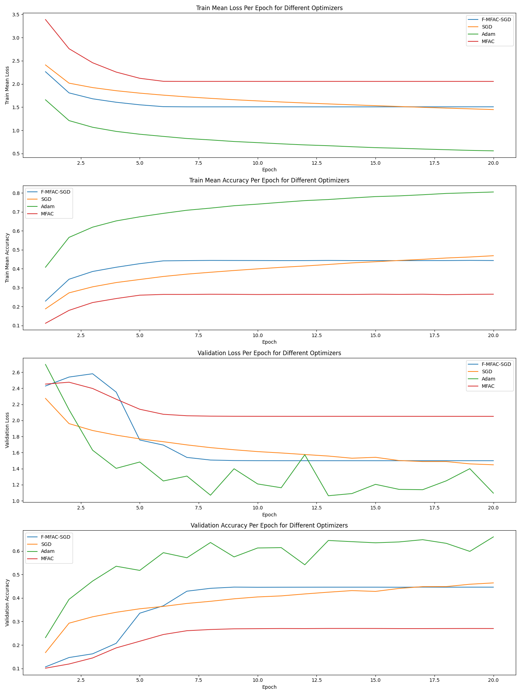

<!--
<p align="center">
  
</p>
-->

<h1 align="center">
  m_fac_tf
</h1>

<p align="center">
    </a>  
    <a href="https://github.com/cthoyt/cookiecutter-python-package">
         
    </a>
    <a href='https://github.com/psf/black'>
        
    </a>
    <a href="https://github.com//f-mac-tf/blob/main/.github/CODE_OF_CONDUCT.md">
        
    </a>
</p>

Implementation of F-MAC algorithm of Frantar et. al. (2021) in Tensorflow.

## :warning: Remark
We use absolute imports from the project home directory (e.g. here where the README is located).
For this the project home directory must be added to the module search path. This can for example be achieved by adding a '.env' file at project home level containing 'export PYTHONPATH="$PYTHONPATH:$PWD"'.

## Status:

Due to runtime issues, we used a higher learning_rate and fewer epochs. We will update the results again as soon as all runs have been completed.

## M-FAC:

This repository contains efficient reference implementations of the dynamic M-FAC algorithms based on SGD and Adam Optimizers in TensorFlow, introduced in the paper "M-FAC: Efficient Matrix-Free Approximations of Second-Order Information" to be published at NeurIPS 2021, plus some sample code demonstrating their use in optimization. In addition, the results are compared in plots with the results of a normal Adam and SGD optimiser.

This repository contains the follwowing:

An efficient Implementation of an M-FAC Optimizer based on SGD from Scratch, an efficient Implementation of an M-FAC Optimizer which inherits from the SGD Optimizer and an efficient Implementation of an M-FAC Optimizer which inherits from the ADAM Optimizer.
All of these optimisers include the implementation of the dynamic algorithm

A `run_experiments.py` scricpt for running five Optimizers (SGD, Adam, SGD-MFAC (scratch), SGD-MFAC (inherist from SGD) and ADAM-MFAC) on the cifar10 Dataset and on a ResNet (20 or 32) Model. The logs are saved in the `logs` folder

An `experiment.yaml` file, in which the model configurations, e.g. how many gradients used for M-FAC optimisation, for each Optimizer are specified. In addition, the model, the number of epochs and the number of runs to be carried out are defined here.


## Optimization:

Before running the `run_experiment.py` script, all packages from the requirements.txt must be installed.

```
pip install -r requirements.txt
```

The file `experiment.yaml` provides a simple way to specify the hyperparameters of the Optimizers, such as learning_rate. In addition, you can specify multiple values for m so that multiple configurations are tested. For Example with the MFAC-Optimizer

```
MFAC: 
  params: 
    m: [512, 1024] 
    damp: 1e-6 
    learning_rate: 0.001
  batch_size:128
```

This file also defines which data set, which model, which loss, how many epochs and how many runs are to be executed.

```
dataset: cifar10
model: resnet32
loss: sparse_categorical_crossentropy
epochs: 50
runs: 10
```


## 💪 Getting Started

Each experiment must be defined in a configuration in yaml syntax (which is read using ['hydra'](https://hydra.cc/docs/intro/)).
By calling `run_experiment(<configuration name>)` in 'run_experiments.py' one or multiple experiments can be run.
For each experiment and optimizer a dedicated folder will be created in 'logs' containing csv files of tracked metrics for each run and parameter configuration.

## Results
**Experiment 1**


**Experiment 2**


## 👋 Attribution
The idea of our optimizer(s) are not our own but based on the paper by Frantar et. al. 2021 [1].
Special thanks to Prof. Dr. David Rügamer for supervising us.

### ⚖️ License

The code in this package is licensed under the MIT License.

### 🍪 Cookiecutter

This package was created with [@audreyfeldroy](https://github.com/audreyfeldroy)'s
[cookiecutter](https://github.com/cookiecutter/cookiecutter) package using [@cthoyt](https://github.com/cthoyt)'s
[cookiecutter-snekpack](https://github.com/cthoyt/cookiecutter-snekpack) template.

## References

\[1\] GFrantar, Elias et al. “M-FAC: Efficient Matrix-Free Approximations of Second-Order Information.” Neural Information Processing Systems (2021).
